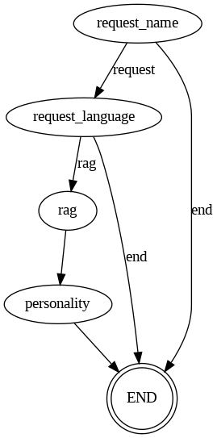

# ¿Qué es este repositorio?
Este repositorio contiene una solución de tipo RAG (Retrieved Augmented Generation) desarrollada como parte de un challenge laboral. La aplicación permite interactuar con un modelo de lenguaje (LLM) a través de una API construida con FastAPI, permitiendo a los usuarios hacer preguntas sobre un documento específico.

La estructura incluye componentes clave como la API para la comunicación, el uso de embeddings para dividir y codificar el documento, y una base de datos vectorial para almacenar y recuperar información relevante.

El repositorio incluye scripts de Python, un archivo requirements.txt, un Dockerfile para contenedores, y el archivo Readme.mdpara facilitar la ejecución local del proyecto.

# Estructura del repositorio
```
├── .vscode
       ├── launch.json
├── api
       ├── chat.py
       ├── graph.py
├── db
       ├── orm 
           ├── orm.py
           ├── orm_models.py
       ├── vector_db
           ├── index.faiss
           ├── index.pkl
           ├── vector_db.py
├── docs          
       ├── documento.docx 
       ├── flujo_nodos.png
       ├── preguntas_test.docx
       ├── prompts.json
├── front
       ├── functions.py
       ├── main.py
├── models
       ├── agent_state.py
       ├── dataclasses.py
├── rutas
       ├── chat.py
├── dataclasses.py
       ├── auxiliar_functions.py
       ├── functions.py
       ├── logger.py
       ├── security.py
├── .env
├── .gitignore
├── docker-compose.yml
├── Dockerfile
├── main.py
├── README.md
├── requirements.txt
```
# ¿Cómo ejecuto este repositorio?
Para ejecutar este repositorio, sigue estos pasos:

`Instalar Docker:` 
Asegurarse de tener Docker instalado en el sistema.

`Ejecución de la API - Explicación:`
Inicia el entorno: Ejecutar el archivo docker-compose.yml para crear el entorno virtual `(.venv)` y las dependencias especificadas en `requirements.txt` . Finalmente correrá los scripts de `vector_db.py`, `main.py` y `front/main.py`. De esta forma se creará la base de datos vectorial, se creará el endpoint de la API y un front de `streamlit` consumirá dicho endpoint.

`Ejecución de la API - Código a ejecutar en la terminal:`
```
docker
```

# Descripción de la solución:
Una vez que se corre el `docker-compose` el usuario puede comenzar a interactuar con el bot en el `front-end` desarrollado con `Streamlit`. El bot primero solicita el nombre del usuario, lo cual genera una nueva sesión que se almacena en la base de datos, en la tabla `sessions`. A su vez se guarda la interacción en la tabla `messages`, ya que se usará dicha tabla en el futuro para rastrear todas las interacciones ocurridas para un mismo `session_id`.

A partir de este punto, el usuario puede realizar preguntas al bot en el idioma que prefiera. El flujo de nodos detecta automáticamente el idioma de las preguntas y garantiza que las respuestas sean generadas en el mismo idioma. El sistema utiliza un enfoque `RAG` (Retrieved Augmented Generation) para buscar información relevante en la base de datos y generar respuestas precisas basadas en los documentos procesados.

# Flujo de nodos:

